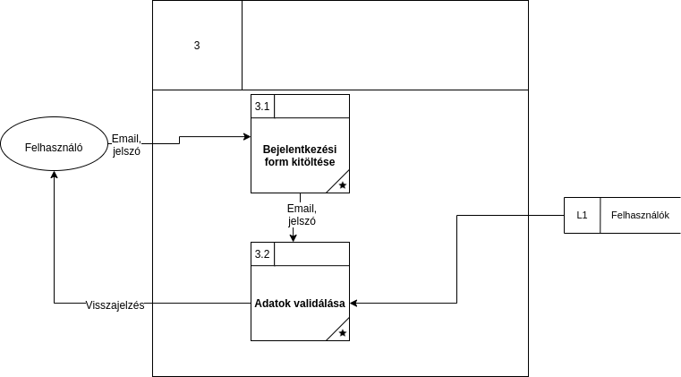
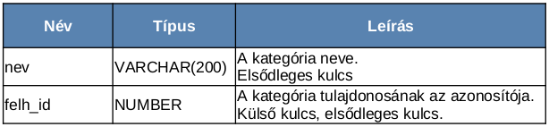

# Social Distancing

---

## Projekt tagok

|     Név      |
| :----------: |
| Kiss Olivér  |
|  Burza Ralf  |
| Balogh Etele |

---

## Telepítés :computer:

- Az adatbázist definiáló és feltöltő szkriptek a `database/db-export.sql` útvonalon találhatók (a ddl.sql, insert.sql az eredeti, ám nem teljes, kézzel írt verziók).
- A backend mappában állítsuk be az adatbázisunk url-jét, és ha szükséges, akkor a felhasználónevünket és jelszavunkat is adjuk meg
az alábbi útvonalon: `backend/src/main/resources/application.properties`. Itt kiválaszthajtuk, milyen portot használjon a backend.

- A frontend mappában `/frontend/proxy.conf.json` állítsuk be a target port számát ugyanarra, mint amire a backendét állítottuk.

Ha ezekkel megvolnánk, akkor a backendet indíthatjuk konzolból maven segítségével (backend directoryben ki kell adni, a `mvn clean install spring-boot:run` parancsot)
vagy tetszőleges mavent támogató fejlesztőkörnyezet segítségével, pl Intelij idea.

A frontendet a frontend mappában kiadott `npm i` parancsot követő installáció után, az `ng s` utasítással indíthatjuk el.

Ha a backend sikeresen csatlakozott az adatbázishoz és fut a frontenddel együtt, akkor az alkalmazást megtekinthetjük böngészőnkben a localhost:4200-as url-en.

## Feladat leírás

A feladat egy online közösségi oldal és a hozzá tartozó adatbázison alapuló szerver-kliens architektúrájú webalkalmazás megvalósítása. Ahol az adatbázis Oracle technológián nyugszik míg a webalkalmazást Angular és Node.js keretrendszerek segítségével készítjük el.

Az alkalmazás egy egyszerű regisztrációt és bejelentkezést követően lehetőséget nyújt arra, hogy új ismerősöket jelölhessünk be illetve meglévőkkel válthassunk üzenetet. Böngészhetünk csoportok között melyekhez csatlakozhatunk. Csoportokat is alakíthatunk, ahol hasonló érdeklődési körrel rendelkezők gyűlhetnek össze -- hobbi, iskola, munkahely. A profilunkat testreszabhatjuk, megadhatjuk a születési dátumunkat, nevünket, volt iskoláinkat, munkahelyeinket, lakhelyünket, hobbijainkat. Létrehozhatunk fényképalbumokat, melyeket rendszerezhetünk és nevet is adhatunk nekik. Illetve a hírfolyamon is elhelyezhetünk eseményeket, képeket, bejegyzéseket melyekre jöhetnek likeok illetve megjegyzések.

---
## Követelmény katalógus

- **Látogató** tudjon megtekinteni csoportokat és azok nyilvános bejegyzéseit, illetve más felhasználók nyilvános bejegyzéseit (pl.: újságcikk, esemény)
- Még nem regisztrált emailcímmel lehessen regisztrálni, azt követően lehessen belépni emailcím / jelszó párossal
- A belépett **felhasználó** legyen képes
  - kijelentkezni
  - a saját profilját szerkeszteni (profilkép, adatok módosítása)
  - **fényképalbum**okat létrehozni:
    - lehessen a képeket **kategorizálni**
    - kategóriáknak legyen neve
  - a saját **hírfolyam**át szerkeszteni (események, fényképek megosztása -- **poszt**olás)
  - keresni **csoport**ok és felhasználók között
  - ismerősnek jelölni / jelöléseket elfogadni
  - **üzenet**et váltani ismerőssel
  - ismerős hírfolyamán bejegyzést elhelyezni (posztolás) (pl.: születésnapi felköszöntés)
  - csoportot létrehozni / **csoporthívás**t elfogadni
  - **bejelentés**t tenni csoportokról vagy más felhasználókrol
- Csoportok (minden csoport nyilvános, látható hogy létezik)
  - egy felhasználó hozza létre, ő lesz a tulaj
  - a tulaj és az arra jogosultak adhassanak további rangokat (sima tag, csoport admin, moderátor, lelkes rajongó)
  - lehessen kiválasztani, hogy az egyes rangú felhasználók neve milyen színnel jelenjen meg a **komment** szekciókban
  - bárki beléphet, viszont meghívni is lehet felhasználókat
  - a posztok alapértelmezetten csoport láthatóságúak, viszont a tulaj nyilvánossá teheti
- Az **adminisztrátor**ok
  - tudjon csoportot vagy felhasználót törölni a rendszerből

### Részletezések
Posztolni csoport vagy felhasználó hírfolyamába lehet. A poszt láthatóságáról a közzétételkor dönthet a felhasználó,
alapértelmezetten nem nyilvános. Ez azt jelenti, hogy:
- csoport esetében, a posztot csak a csoport tagjai látják
- felhasználó esetében a posztot, csak a hírfolyam tulajdonosa és közvetlen ismerősei láthatják.

A posztokhoz tartozhatnak kommentek, bárki hagyhat kommentet aki láthatja a posztot.

---

## Adatfolyam diagram

### 1. szint

### 2. szint
##### Felhasználók-Csoportok böngészése

##### Bejelentkezés

##### Profilszerkesztés

##### Ismerősök áttekintése

##### Profil megtekintése

##### Csoportok áttekintése

##### Tagok áttekintése

##### Meghívások áttekintése

##### Posztolás

---

## Egyed modell

---

## Egyed-kapcsolat diagramm

### Egyed-kapcsolat leképezés

- Fénykép (__id__, kep, kep_nev, <ins>*kat_nev*</ins>, <ins>*felh_id*</ins>)
- Kategória (__név__, <ins>*Felhasznalo\_id*</ins>)
- Felhasználó (__id__, jelszo, email, keresztnev, vezeteknev, szul_dát, csatl_dat, munka_iskola, picture, isAdmin)
- Üzenet (**id**, időpont <ins>*Felhasználó\_id*</ins>, <ins>*Címzett\_id*</ins> , szöveg)
- Meghívás (<ins>*Felhasználó\_id*</ins>, <ins>*Címzett\_id*</ins>, <ins>*Csoport\_id*</ins>, időpont, elfogadva)
- Csoport (__csoportId__, leiras, nev, <ins>*tulaj\_id*</ins>)
- Poszt (**id**, időpont, <ins>*szerzo_id*</ins>, <ins>*csoport_id*</ins> , <ins>*felhasznalo\_id*</ins>, szoveg, dislike, like, isPublic)
- Komment (**id**, idopont, <ins>*komment_iro_id*</ins>, <ins>*poszt\_felh\_id*</ins>, <ins>*poszt\_id*</ins> , szoveg, like, dislike, isPublic)
- Tagja (<ins>***felhasznalo\_id***</ins>, <ins>***csoport\_id***</ins>)
- Ismeros ( <ins>***felhasznalo1\_id***</ins>, <ins>***felhasznalo2_id***</ins> )

---

## Adattáblák leírása

**Nevtipus**: A későbbi táblákban használt névtípus

**ERTEKELES**: A későbbi táblákbna használt értékelés típus

**Felhasznalo**: Az alkalmazás felhasználóit tartalmazó tábla

**Csoport**: Az alkalmazás csoportjait tartalmazó tábla

**Poszt**: A felhasználók által létrehozható posztokat tartalmazó tábla

**Komment**: A Posztokhoz fűzhető kommenteket tartalmazó tábla

**Uzenet**: A felhasználók egymásnak küldött üzeneteit tartalmazó tábla

**Meghivas**: A csoportokba történő meghívásokat tartalmazó tábla

**Tagja**: A csoportok tagjait számontartó tábla

**Ismeros**: Az ismerősi kapcsolatokat számontartó tábla

**Kategoria**: A fényképekhez létrehozható kategóriákat tartalmazó tábla

**Kep**: A felhasználók által feltöltött fényképek elérési útvonalait tartalmazó tábla

---

## Szerep funkció mátrix

