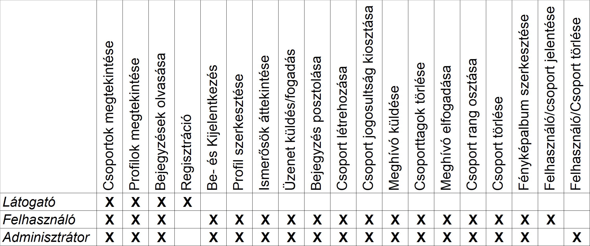

#  Projekt: Social disctancing


## Projekt tagok

|     Név      |
| :----------: |
| Kiss Olivér  |
|  Burza Ralf  |
| Balogh Etele |
|   Svatlana   |

---

## Telepítés :computer:

A `backend/` mappában hozzunk létre egy `db.config.js` fájlt amiben megmondjuk az oracle felhasználónk nevét, jelszavát és a connection stringet:

```js
var oracledb = require('oracledb');
oracledb.getConnection({
      user: "XXXXXX",
      password: "********,
      connectString: "localhost:1521/xe" // pl.
}, function(err, connection) {
if (err) {
    console.error(err.message);
    return;
}
     connection.execute("SELECT * FROM table",[], function(err, result) { // teszt lekérdezés egy táblából, írjuk át!
    if (err) { console.error(err.message);
          doRelease(connection);
          return;
     }
     console.log(result.metaData);
     console.log(result.rows);
     doRelease(connection);
   });
});
function doRelease(connection) {
       connection.release(function(err) {
         if (err) {
          console.error(err.message);
        }
      }
   );
}
```

Ahhoz hogy ez működjön, kell hogy legyen a gépen oracle instantclient (basic package) és sdk (illetve ezeknek elérhetőnek kell lenniük a pathben). Ezeket [itt](https://www.oracle.com/database/technologies/instant-client/winx64-64-downloads.html) érhetjük el.

Ezt követően a node db.config.js parancsot kiadva ha minden igaz csatlakoztunk az adatbázishoz és sikeresen végrehajtottunk egy lekérdezést.

---

## Feladat leírás :pencil:

A feladat egy online közösségi oldal és a hozzá tartozó adatbázison alapuló szerver-kliens architektúrájú webalkalmazás megvalósítása. Ahol az adatbázis Oracle technológián nyugszik míg a webalkalmazást Angular és Node.js keretrendszerek segítségével készítjük el.

Az alkalmazás egy egyszerű regisztrációt és bejelentkezést követően lehetőséget nyújt arra, hogy új ismerősöket jelölhessünk be illetve meglévőkkel válthassunk üzenetet. Böngészhetünk csoportok között melyekhez csatlakozhatunk. Csoportokat is alakíthatunk, ahol hasonló érdeklődési körrel rendelkezők gyűlhetnek össze -- hobbi, iskola, munkahely. A profilunkat testreszabhatjuk, megadhatjuk a születési dátumunkat, nevünket, volt iskoláinkat, munkahelyeinket, lakhelyünket, hobbijainkat. Létrehozhatunk fényképalbumokat, melyeket rendszerezhetünk és nevet is adhatunk nekik. Illetve a hírfolyamon is elhelyezhetünk eseményeket, képeket, bejegyzéseket melyekre jöhetnek likeok illetve megjegyzések.

---
## Követelmény katalógus :book:

- **Látogató** tudjon megtekinteni csoportokat és azok nyilvános bejegyzéseit, illetve más felhasználók nyilvános bejegyzéseit (pl.: újságcikk, esemény)
- Még nem regisztrált emailcímmel lehessen regisztrálni, azt követően lehessen belépni emailcím / jelszó párossal
- A belépett **felhasználó** legyen képes
  - kijelentkezni
  - a saját profilját szerkeszteni (profilkép, adatok módosítása)
  - **fényképalbum**okat létrehozni:
    - lehessen a képeket **kategorizálni**
    - kategóriáknak legyen neve
  - a saját **hírfolyam**át szerkeszteni (események, fényképek megosztása -- **poszt**olás)
  - keresni **csoport**ok és felhasználók között
  - ismerősnek jelölni / jelöléseket elfogadni
  - **üzenet**et váltani ismerőssel
  <!-- - üzenetet váltani ismeretlennel (engedélykérések) :question: -->
  - ismerős hírfolyamán bejegyzést elhelyezni (posztolás) (pl.: születésnapi felköszöntés)
  - csoportot létrehozni / **csoporthívás**t elfogadni
  - **bejelentés**t tenni csoportokról vagy más felhasználókrol <!-- :question: -->
- Csoportok (minden csoport nyilvános, látható hogy létezik)
  - egy felhasználó hozza létre, ő lesz a tulaj
  - a tulaj és az arra jogosultak adhassanak további rangokat (sima tag, csoport admin, moderátor, lelkes rajongó) <!-- :question: -->
  - lehessen kiválasztani, hogy az egyes rangú felhasználók neve milyen színnel jelenjen meg a **komment** szekciókban
  - bárki beléphet, viszont meghívni is lehet felhasználókat
  - a posztok alapértelmezetten csoport láthatóságúak, viszont a tulaj nyilvánossá teheti
- Az **adminisztrátor**ok
  - tudjon csoportot vagy felhasználót törölni a rendszerből :cop:

### Részletezések
Posztolni csoport vagy felhasználó hírfolyamába lehet. A poszt láthatóságáról a hírfolyam tulajdonosa dönthet,
alapértelmezetten nem nyilvános. Ez azt jelenti, hogy:
- csoport esetében, a posztot csak a csoport tagjai látják
- felhasználó esetében a posztot, csak a hírfolyam tulajdonosa és közvetlen ismerősei láthatják.

A posztokhoz tartozhatnak kommentek, bárki hagyhat kommentet aki láthatja a posztot.

További finomítás: mik lehetnek az egyes egyedek attribútumai
- felhasználó
  - id
  - admin (boolean)
  - létrehozás dátuma
  - profilkép
  - adatok:
    - név
    - születési dátum
    - volt munka / iskolahely (lista)
    - aktuális munka / iskolahely (lista)
- fényképalbum
  - kihez tartozik (felh id)
  - kategória id (lista)
- kategória
  - név
  - leírás
  - fénykép (lista)
- csoport
  - csoport id
  - tulaj id
  - tagok (id lista)
  - adatok:
    - név
    - leírás
- hírfolyam
  - ez egy kapcsolótábla lesz a posztok és (felhasználók / csoport) id-k között ?
  - mivel nincs többágú kapcsolat ezért két külön hírfolyam tábla kell majd :cry:
- poszt
  - szerző felhasználó id
  - "címzett" csoport vagy felh. id
    - itt sem lehet egybevenni őket (nincs többágú kapcsolat) ezért valszeg két "példány" kell majd
  - létrehozás időpontja
  - láthatóság (nyilvános: boolean)
  - szöveg
  - képek (lista)
  - like / dislike számláló
- komment
  - poszt id (mihez tartozik)
  - szerző felhasználó id
  - szöveg
  - like / dislike számláló
- üzenet
  - feladó id
  - címzett id
  - szöveg
  - időpont
- meghívás
  - kit (id)
  - hova (id)
  - időpont
  - elfogadva (boolean)
- bejelentés
  - feladó id
  - feljelentett id
  - időpont
  - leírás

# Adatfolyam diagram

[első szint](https://drive.google.com/file/d/1SW9K7K-O7WFHSXmzR3vVcFwOKDXmNJM7/view?usp=sharing)
---
# EK diagram

## EK leképezés

-Fénykép (_id_, kép, név, *kategoria_id*)
-Kategória (_név_)
-Fényképalbum (_*Felhasználó.id*_,*kategória.név*)
-Felhasználó (_id_, jelszó, szül.dát, isAdmin, csatlakozásDátum, keresztnév, vezetéknév, munka-iskola, profilkép, *Hírfolyam.id*)
-Üzenet (_id_, _*Felhasználó.id*_, _*Címzett.id*_ , szöveg , küldésIdő)
-Meghívás (_*Felhasználó.id*_, _*Címzett.id*_, _*Csoport.id*_, küldésIdő, isAccepted)
-Csoport (_csoportId_, leírás, név, *tulaj.id*, *Hírfolyam.id*)
-Hírfolyam (_id_)
-Poszt (_id_, _*Hírfolyam.id*_, szöveg, dislike, like, időpont, isPublic)
-Komment (_id_, _*Felhaszánló.id*_ , _*Poszt.id*_ , szöveg, időpont, like, dislike)

## Szerep funkció mátrix


